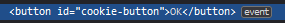
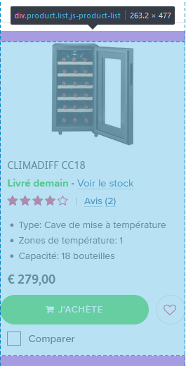
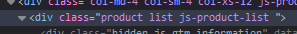
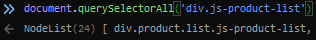
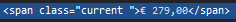

# Scraper Documentation
## Introduction
Welcome to the scraper documentation, the scraper is mainly using the [pyppeteer](https://github.com/pyppeteer/pyppeteer) library to control a chrome web browser as if it was a "real" user.
## Limitations
At the moment, the scraper only has support for 2 different webshops, due to time constraints we were not able to add more.

It is also good to note that the pyppeteer library is not up to date with the latest version of the library it is based on (puppeteer), so maybe porting the whole scraping code to node.js at some point later in time might be worth the work.

As the chrome instance is running in its own container, and as the pyppeteer haven't implemented yet the option to use proxies without re-launching the browser, you might need to look into [docker proxies](https://docs.docker.com/network/proxy/) if you want to use proxies.

The scraper might crash while scraping a website if a field on there changed, or sometimes for unknown reasons (probably due to the pyppeteer itself), which is why on startup it will cleanup the leftover sessions if something went wrong during the previous scrape

It is not intented to run multiple scrapes at the same time while connecting to the same chrome browser.

As the connection to the chrome browser is not authenticated, it is highly recommended that the chrome container debug port (9222) is never to be exposed to the internet.

As each and every webshop is different, we were unfortunately unable to have a "magic scraper" that could scrape anything and everything, you will need to add support for now webshops yourself.

## Using the scraper
The scraper is currently made to be able to run using the command
```
python scraper.py URL_TO_SCRAPE SCRAPER_ID
```
Where URL_TO_SCRAPE is the url of the "category" page of a webshop that you'd like to scrape and SCRAPER_ID is the scraper id in the database for the backend.

The command will use the backend /products endpoint to post its result there.

## Automating scraper launch
As the scraper is made to work with the flask back-end, it can be launched automatically every X minutes/hours/days/week by modifiying the following code in flaskr/app.py
```python
@app.route('/check-queue')
def check_queue():
     for scraper in Scraper.find_all():
          if scraper.status is not Status.inqueue.value and scraper.start_date < datetime.utcnow() and scraper.end_date > datetime.utcnow() and (scraper.last_scanned + timedelta(hours=20)) < datetime.utcnow():
               scraper.status = Status.inqueue.value
               scraper.save_to_db()
               q.put(scraper.id)
     return "", 200
```
By changing hours=20 to the interval you'd like

You can also change into the flaskr/Dockerfile the following line 
```docker
RUN crontab -l | { cat; echo "*/5 * * * * curl http://localhost:8500/check-queue"; } | crontab -
```
To an interval you'd like this will check and add into the queue any scraping task that needs to be done every 5 minutes. If you want to change the interval without learning about cron, [this](https://crontab.guru/) is a great place to do so.
## Adding a new webshop
To add support for a new webshop, you will first need to follow these steps:
### Inherit from the GenericScraper class
You will need to inherit from the GenericScraper class and create a new class for your custom scraper. This can by done like so
```python
class CustomScraper(GenericScraper):
```
### Redefine the GenericScraper create method
You will now need to redefine the methods of the GenericScraper classes like so
```python
class CustomScraper(GenericScraper):
    @classmethod
    async def create(cls, browser, url):
        self = cls()
        self.url = url
        par = await super().create(browser, url)
        self.page = par.page
        self.webshop = "the name of the webshop you want to scrape (it will be automatically added to the database if not existing)"
        self.price_current_field = 'a selector for where the current price of a product is located in the html of the page'
        self.price_reference_field = 'a selector for where the reference price of a product is located in the html of the page (when the product is on sale)'
        self.product_name_field = 'a selector for where the name of a product is located in the html of the page'
        self.product_url_field = 'a selector for where the url to the product page is located in the html of the page'
        self.eval_fct = par.generic_eval.format(self.product_name_field, self.price_current_field, self.price_reference_field, self.product_url_field)
        return self
```
More information about the field/selectors in this [section](#finding-selectors-in-a-webshop-page)

As most of the time in webshops, the same logic can be used but with different selectors, we made a generic eval function that should be able to extract every product information by just giving it the correct selector, if you encounter a website that do not follow that logic, just create your own eval_fct and ignore the fields.
```python
class CustomScraper(GenericScraper):
    async def go_to_page(self, url):
        await super().go_to_page(url)
```

Now that you have a function that can extract product information, it's time to work on the scraping function.

```python
class CustomScraper(GenericScraper):
    async def scrape(self):
        product_informations = []
        await self.go_to_page(self.url)

        # this clicks the "OK" button on the popup asking us for cookies
        if await self.page.querySelector("cookie button selector goes here"):
            await self.page.evaluate("""() => {
                document.querySelector("cookie button selector goes here").dispatchEvent(new MouseEvent("click", {
                    cancelable: true,
                    view: window,
                    bubbles: true
                }));
            }""")
        
        # wait a few seconds to be sure that the page is loaded
        await asyncio.sleep(3)
        
        # this, for example, changes the amount of product shown per page on a webpage with a select option that has the name COUNTERPAGE
        # can be removed if there is no need for such a thing
        await self.page.select('select[name="COUNTPERPAGE"', '0')
        
        # basically waits until first product appears on the page after selection "show me all products on the same page"
        # can be removed if not needed or replace with a sleep
        await self.page.waitForSelector('product selector goes here')

        # screenshots the page with the fullPage option to get everything in a single screenshot        
        big_image = BytesIO(await self.page.screenshot({'type': 'png', 'fullPage': True}))

        # retreive product Nodes from the page using a selector
        product_nodes = await self.page.querySelectorAll('product selector goes here')

        # exctract information for each product Node in the product NodeList obtained previously
        for product_node in product_nodes:
            product_info = await extract_data_from_node(self.webshop, self.page, self.eval_fct, product_node)
            if product_info is not None:
                product_informations.append(product_info)
        get_products_from_screenshot(big_image, product_informations, False)
        return product_informations
```

As you can see, you're pretty much free to do whatever you want in the scraping part, depending on how your website behaves, if there's any extract click you need to make, use the same logic as the popup cookie one.

If your scraper has to click on multiple "next page" button, you can check the x2o scraper to get some inspiration on how we managed it.

Now, all you need to do is to modify the main method, adding your scraper after the last elif, to use your custom scraper for your custom url
```python
elif('customscraper.be' in url):
        scraper = await CustomScraper.create(context, url)
```

## Finding selectors in a webshop page
First, make yourself confortable with this documentation [CSS Selectors](https://www.w3schools.com/cssref/css_selectors.asp) and with the [Pyppeteer API](https://pyppeteer.github.io/pyppeteer/reference.html) as it will be heavly used to find out how to select the fields containing the informations we need to extract.

Open a web browser that has developer tools enabled such as Chrome or Firefox (for this tutorial we'll be using Firefox) and go the webpage that you want to give to the scraper.

If the webpage greets you with a popup asking you about cookies (which they usually do) find out what is the id of the "OK" button by right clicking it and clicking on "Inspect"

In this example  we can see that the button that we want to click can be uniquely identified by the id "cookie-button" which means that the following javascript code will be able to "click" the button as if it was a real user.
```javascript
document.querySelector('#cookie-button').dispatchEvent(new MouseEvent("click", 
    {
        cancelable: true,
        view: window,
        bubbles: true
    }
));
```

Once the poupup is out of the way, it's time to search where the product informations are stored. To do that, right click on a product in the webshop and click inspect, now move your mouse around going up in the hierarchy such that the highlighted area in the page contains everything about that product like so

 


In the example above, you can see that the following code would get you a Node referencing to every product. ('div.js-product-list' being our selector)
```javascript
document.querySelectorAll('div.js-product-list')
```
You can verify that it's correct by going to the console tab in your dev tools and checking that the size of the NodeList is equal to the amount of products being displayed on the page (24 here in our example case)



Now that you have a way to retreive every Node containing individual product information, it's time to find out how to extract the relevant information out of them.
To do that, we'll right click the price on a product and click inspect.
In this example  we can see that (assuming that product_node is the Node containing our product information) the following code would give us the product current price. ('span.current' being our selector here)
```javascript
product_node.querySelector('span.current').innerText
```

The same logic applies to the product reference price and to the product name as well, but what about the link to the product page?

Since the link is not in the innerText of the html but instead the value of the href, we just need to do .href instead of .innerText

Same logic applies if you want to extract information out of custom tags, just do .customTag instead of .innerText

Don't forget that you can always use the developper tools console to check if your selectors are correct and are behaving as expected.

## DISCLAIMER
Any image used in this documentation is taken for educational and demonstration purposes only.